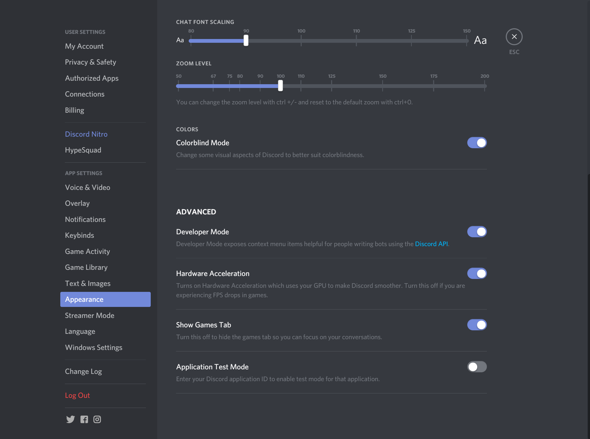
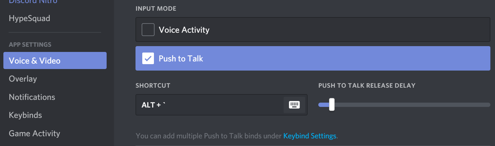
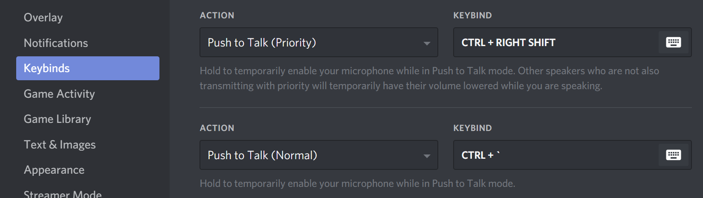

# Setting up Discord

## Developer Mode

Turning on developer mode will allow you to grab ids and more efficiently fulfill your position.

You can also get a user's id with: `!info [user]` in \#mod-bot-spam Right click the user's name and click 'Copy ID'

Please enable Developer Mode in user settings as shown in the photo to make sure you have access to the second method \(right click &gt; copy ID\)


 Developer Options adds the Copy ID option on several right-click prompts and is available on mobile after being enabled as well.


### Enabling Priority Speaker

In addition, you may want to enable **Priority Speaker Mode**, this halves the volume of others in a voice channel allowing to be heard clearly over a hectic voice chat.


It requires Push-to-Talk be enabled, and a separate keybind from normal push-to-talk These options can be set as seen in the image below - keybinds are just an example, use what you’re comfortable with.



This is only available for moderators, not Tenno Supporters.


